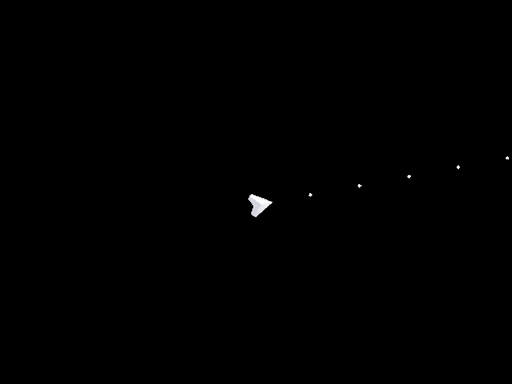

redhorizon-juniperdev-spintowin
===============================

Using Red Horizon to try create an entry for [The Very Serious Juniper Dev Game
Jam](https://itch.io/jam/theveryseriousjuniperdevgamejam).  Theme: Spin To Win

My idea for the theme was to make a top-down shooter where you could curve
bullets a-la the movie _Wanted_, by spinning your ship.  Unfortunately, I didn't
get very far as the lengthy [Issues and lessons learned](#issues-and-lessons-learned) section details.

Assets used
-----------

 - [Kenney Simple Space](https://kenney.nl/assets/simple-space)
 - [16Bit Bullets, Explosions & Misc Asset Pack](https://jinvorionstg.itch.io/bullet-asset-pack-top-down-or-shmup-classic-bullet-hell-style)

Issues and lessons learned
--------------------------

Well, I didn't really expect to get a lot done in this one as it was the first
time I had tried to use Red Horizon in anger, AND had a 2-day work trip on while
the jam ran (meaning 3 nights not being able to work on this if I count regular
games night).  I mostly expected to be fixing or tweaking the engine to make it
do what I wanted, and that's basically what happened.

Once I had an empty scene with a ship on it, I added mouse tracking and
immediately spotted a bug in the engine: the value reported by the viewport
would magically double for both axes on some frames, causing screen-to-world
calculations to fail like the 'make ship look at the mouse' code.  This resulted
in the ship suddenly changing heading in random frames.

With the jump headings sorted, the next thing to overcome was gamepad controls
(I don't know why I wanted to do the spinning with a gamepad as the jam rules
required only mouse and keyboard for input).  An older version of Red Horizon
had gamepad controls, but those hadn't been restored since the 0.4x.x releases
where I broke the engine up into standalone modules.  So the next little while
was restoring that functionality, then discovering that it didn't have gamepad
mappings for my controller because [GLFW hasn't been updating their SDL gamepad
mappings since 2021](https://github.com/glfw/glfw/pull/2745) 🤦‍♂️

And when that was finally sorted, I tried to make the ship spin with a simple
rotation transform of the ship sprite, only to find it then being clipped at
certain points/angles.  This one was because the camera only had a depth range
of 0-10, and the ship sprite was far larger than that.

So in all, the engine wasn't fully ready for the idea I had, and much of the
time I had between other commitments was spent fixing issues and plugging
feature gaps.  It was still hella fun to have something like this to work
towards, and I'd be happy to enter another jam in the future that runs for long
enough to allow me to fit it into everything else I have going 😊
